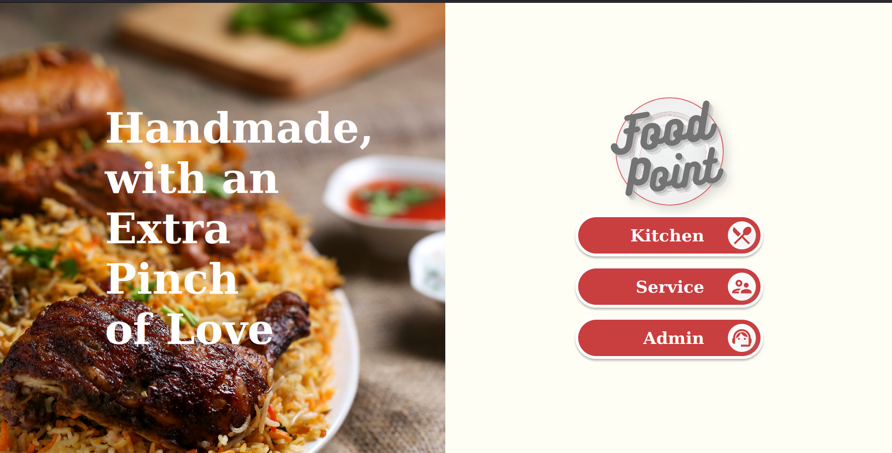

# Food Point

     

## Descripcion

Food point consiste en una aplicacion de punto de venta para restaurantes. Consiste en diferentes modulos con una interfaz amigable. Entre las caracteriticas con las que cuenta son la funcionalidad de Servicios donde se generan ordenes en base a los items dados de alta. Modulo de Cocina para visualizar las ordenes dadas de alta y poder cambiar su estatus. Reportes, para poder llevar el control de las ventas.

## 🧑🏼‍🏭 Colaboradores:

- xManuel007 <maanuu.009@gmail.com>
- MaxRetana <maxretana981@gmail.com>
- AMCernas <elswordmon@gmail.com>
- DiegoMoralesBravo <diegomorales1359@gmail.com>
- ikerismak <ikerismak@gmail.com>

## :iphone: Tecnologías:
- Visual Studio Code
- Ruby on Rails
- Git
- Github
- POO
- Rubocop
- Sandimeter
- Rubycritic

## :mag_right: Metodología de trabajo:
Mob Programming:
Mob Programming es un enfoque de desarrollo de software en el que todo el equipo trabaja en lo mismo, al mismo tiempo, en el mismo espacio y en la misma computadora. Esto es similar a la programación en pareja donde dos personas se sientan en la misma computadora y colaboran en el mismo código al mismo tiempo. Con la programación mob, la colaboración se extiende a todos los miembros del equipo, sin dejar de usar una sola computadora para escribir el código e ingresarlo en la base del código.